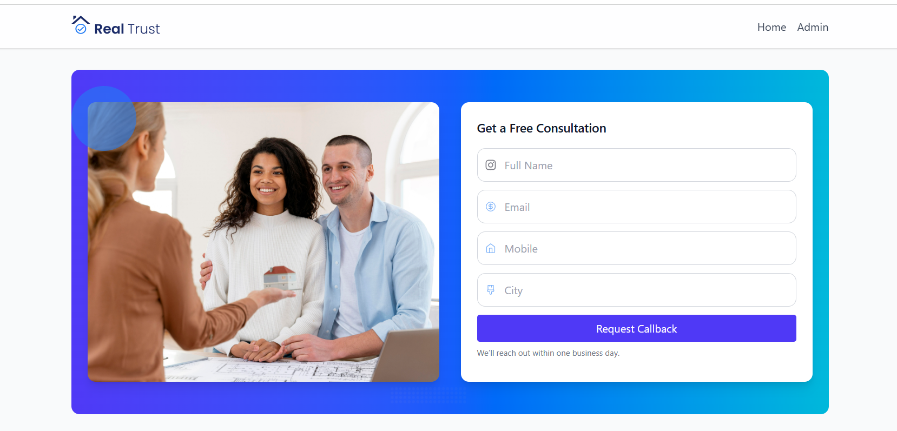
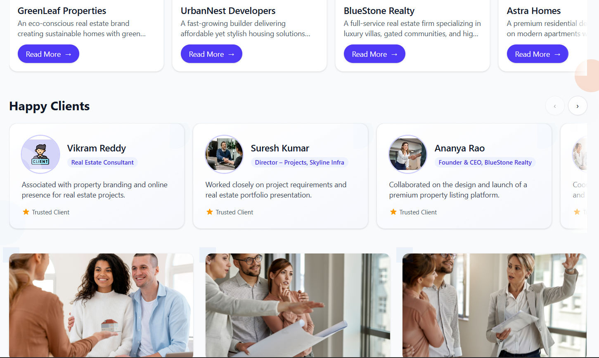
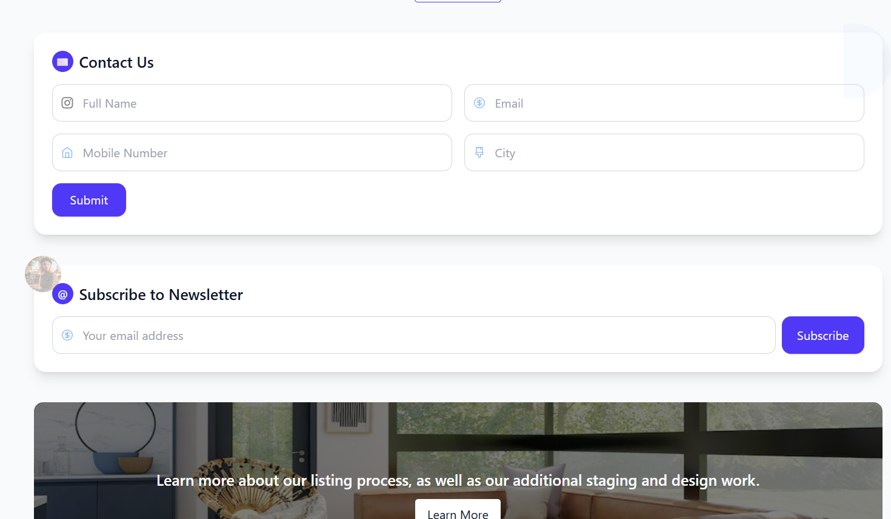
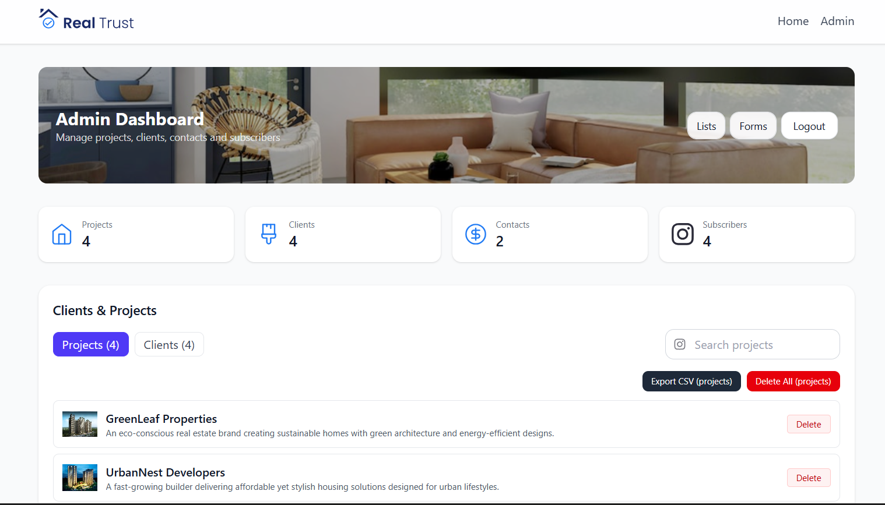
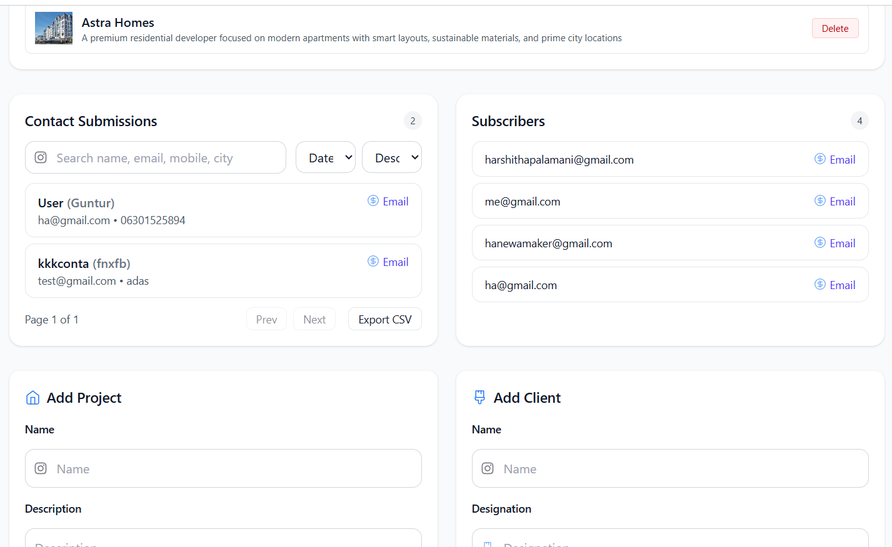

# Full Stack Project – Placement Assignment

## Overview

This is a full-stack web application featuring a landing page and an admin panel. The application allows users to view projects, happy clients, submit contact forms, and subscribe to a newsletter. The admin panel enables management of projects, clients, contact form responses, and newsletter subscriptions.

---

## Features

### Landing Page

- **Our Projects**: Displays all projects fetched from the backend (image, name, description, dummy "Read More" button).
- **Happy Clients**: Shows all clients fetched from the backend (image, name, description, designation).
- **Contact Form**: Users can submit their details (name, email, mobile, city) to the backend.
- **Newsletter Subscription**: Users can subscribe with their email address.

### Admin Credentials

To access the admin panel, use the following credentials:

- **Username:** admin@example.com
- **Password:** admin123

### Admin Panel

- **Project Management**: Add, view, and manage projects (image, name, description).
- **Client Management**: Add, view, and manage clients (image, name, description, designation).
- **Contact Form Details**: View all contact form submissions.
- **Subscribed Emails**: View all newsletter subscribers.

### (Optional Bonus)

- **Image Cropping**: Images uploaded from the admin panel are cropped to a specific ratio before being stored.

---

## Technologies Used

- **Frontend**: React, Vite, Tailwind CSS
- **Backend**: Node.js, Express.js
- **Database**: MongoDB Atlas (cloud)
- **Other**: Docker (for backend), Vercel/Netlify (for frontend deployment)

---

## Approach

- Designed the frontend using React and Tailwind CSS for a modern, responsive UI.
- Built RESTful APIs with Express.js for all CRUD operations.
- Used MongoDB Atlas for cloud database storage.
- Implemented image upload and cropping (bonus) using Multer and Sharp.
- Deployed backend and frontend on cloud platforms for public access.

---

## Setup Instructions

### Prerequisites

- Node.js (v16+)
- npm or yarn
- MongoDB Atlas account (for database)
- Docker (optional, for backend containerization)

### Backend

1. Navigate to the backend folder:
   ```
   cd backend
   ```
2. Install dependencies:
   ```
   npm install
   ```
3. Create a `.env` file with your MongoDB URI and other secrets:
   ```
   MONGODB_URI=your_mongodb_atlas_uri
   PORT=5000
   ```
4. Start the server:
   ```
   npm start
   ```
   Or with Docker:
   ```
   docker build -t backend-app .
   docker run -p 5000:5000 backend-app
   ```

### Frontend

1. Navigate to the frontend folder:
   ```
   cd frontend
   ```
2. Install dependencies:
   ```
   npm install
   ```
3. Create a `.env` file with the backend API URL:
   ```
   VITE_API_URL=http://localhost:5000
   ```
4. Start the development server:
   ```
   npm run dev
   ```

---

## Deployment Links

- **Frontend Live URL**: https://task-eta-lovat.vercel.app/
- **Backend Live URL**: https://task-dl8q.onrender.com/
- **GitHub Repository**: https://github.com/harshithapalamani/task.git

---

## Screenshots








## Contact

For any queries, contact: harshithapalamani@gmail.com

